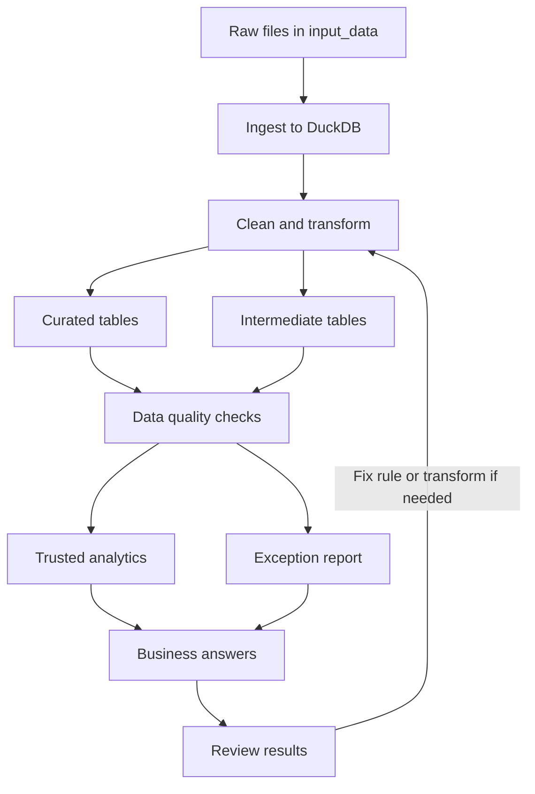

# OmniRetail Data Management Pipeline

This project builds a local data pipeline for OmniRetail customer-360 and order reconciliation work. It reads the provided source files, creates curated tables, runs data quality checks, writes an exception report, and answers five business questions with SQL.

The pipeline is modular so each layer has a clear job: load data, clean and model it, validate it, then report on it.

## Repository structure

```
omni-retail-agentic-data-management/
├── input_data/          Source CSVs, JSONL, STTM mapping, and DQ rules
├── src/
│   ├── pipeline.py      Single entrypoint
│   ├── ingest.py        Load raw files into DuckDB
│   ├── transform.py     Clean data and build curated tables
│   ├── quality_checks.py
│   └── reporting.py     Write Markdown and CSV outputs
├── sql/
│   ├── curated_model.sql
│   └── business_questions.sql
├── tests/               Row count, reference, amount, and parsing checks
├── outputs/             Generated database and reports
├── README.md
├── APPROACH.md          Design decisions and tradeoffs
├── AI_USAGE.md          How the agentic tool was used and verified
└── requirements.txt
```

## Technology stack

- **Python 3.10+** for orchestration and transforms
- **DuckDB** as the local analytical database
- **pandas** for file loading and cleaning helpers
- **SQL** for curated-model documentation and business questions
- **pytest** for automated checks

## Pipeline workflow



How to read this:

1. **Ingest** loads all CSV and JSONL files into DuckDB.
2. **Clean and transform** splits work into curated tables (trusted) and intermediate tables (kept for audit, including bad keys).
3. **Data quality checks** use both paths, then produce trusted analytics and an exception report.
4. **Business answers** use the curated model; question 3 also uses exception findings.
5. **Review** can feed back into transform or quality rules if a check or total looks wrong, then the pipeline is rerun.

## What each layer does

### Ingestion

`src/ingest.py` loads:

- `customers.csv`
- `products.csv`
- `orders.csv`
- `payments.csv`
- `support_tickets.jsonl`

Supporting guidance files (`sttm_target_mapping.csv`, `data_quality_rules.csv`, question list) inform the transform and quality layers. Ingestion does not apply business logic. It only loads the files consistently into DuckDB.

### Curated model

| Table | Purpose |
|------|---------|
| `dim_customer` | Deduplicated customers with standardized name, email, phone, country, state, signup date, and loyalty tier |
| `dim_product` | Products with category, unit price, and active flag |
| `fact_order` | Trusted orders with amounts, variance, and shipping state |
| `fact_payment` | Payments linked to curated orders |
| `fact_customer_issue` | Support tickets with category and sentiment |
| `dq_exception_report` | Rule failures with severity and suggested action |

Intermediate tables (`int_order`, `int_payment`, `int_customer_issue`) keep cleaned rows that failed foreign-key checks so quality and business question 3 can still inspect them.

### Customer cleaning

- Build `full_name` from first and last name
- Lowercase email
- Map country values such as US / United States to `USA`
- Map full state names to two-letter codes
- Parse mixed signup-date formats
- Resolve duplicate `customer_id` (example: `C006`) and keep a survivor row
- Record removed duplicates in the exception report
- Flag shared phone numbers for review, but do not auto-merge different customer IDs

### Product cleaning

- Cast unit price to numeric
- Keep inactive products in the dimension for history
- Flag completed orders that use inactive products

### Order transformation

- Remove duplicate order `O1018`
- Parse mixed timestamp formats into an order date
- Standardize shipping state
- Cast quantity and totals to numeric
- Calculate `calculated_order_amount = quantity x unit_price`
- Calculate `order_amount_variance = gross_order_amount - calculated_order_amount`
- Keep invalid customer or product references out of curated facts, but retain them in intermediate tables and exceptions

### Payment reconciliation

- Parse payment dates and cast amounts
- Compare settled payments to completed order totals
- Detect missing payments, amount mismatches, and orphan payments
- Keep voided and refunded payments available for audit context

Known examples:

- `O1021`: order total $50.00, settled payment $44.00
- `O1024`: completed order with no settled payment
- `PMT029`: orphan payment for nonexistent order `O9999`

### Support ticket processing

- Load JSONL tickets
- Parse timestamps when possible
- Preserve tickets with bad timestamps, set curated date null, and log an exception
- Flag tickets with invalid customer references
- Use negative sentiment for the relationship analysis in question 5

## Data quality checks

Checks cover duplicates, invalid references, timestamp failures, negative quantities, inactive products, order arithmetic mismatches, and payment mismatches.

Each exception row includes:

- Rule ID
- Dataset
- Record key
- Severity
- Issue description
- Suggested action

Outputs:

- `outputs/exceptions.csv` for row-level investigation
- `outputs/data_quality_report.md` for rule and severity summary

## Business answers

Answers are produced by `sql/business_questions.sql` against the curated model. They are not hard-coded.

**Completed revenue definition:** `order_status = completed`, valid customer and product keys, and `quantity > 0`. Defective orders stay in exceptions and question 3.

| Question | Method in short |
|----------|-----------------|
| 1. Completed revenue by month | Sum trusted completed order totals by year-month |
| 2. Top 10 customers | Join trusted orders to `dim_customer`, aggregate, order by value |
| 3. Exception orders | List orders with bad FKs, payment issues, or suspicious quantity |
| 4. Revenue by state | Same trusted filter as Q1, group by shipping state |
| 5. Negative tickets vs exceptions | Compare customers with negative tickets to customers with order or payment exceptions |

Current Q1 result under that definition:

| Month | Completed revenue | Orders |
|-------|------------------:|-------:|
| 2025-03 | $440.70 | 9 |
| 2025-04 | $356.97 | 7 |
| 2025-05 | $446.20 | 9 |

See `outputs/business_answers.md` for the full generated answers.

## Installation

```bash
cd omni-retail-agentic-data-management
python -m pip install -r requirements.txt
```

## Running the pipeline

```bash
python -m src.pipeline
```

Or:

```bash
python src/pipeline.py
```

This regenerates:

- `outputs/curated.duckdb`
- `outputs/data_quality_report.md`
- `outputs/exceptions.csv`
- `outputs/business_answers.md`

## Running the tests

```bash
python -m pytest tests/ -q
```

Tests cover row counts after dedupe, referential checks, amount mismatch detection (including `O1021`), and malformed timestamp handling (`T010`).

## Design summary

- Exact ID duplicates are resolved in transform. Fuzzy phone overlaps are informational only.
- Invalid foreign keys are quarantined from curated facts and kept visible in intermediate tables and the exception report.
- Settled payments are reconciled against completed order totals. Voided or refunded payments are not treated as current settled cash.
- Business SQL lives in `sql/` so analytics stay reviewable outside Python.

## Build process notes

Cursor was used to plan, generate, and debug the pipeline. Generated code was run and checked before acceptance. Structure and schema were adjusted after reading the full take-home brief, and business answers were recomputed independently to confirm they come from the model. Details, prompts, and verification notes are in `AI_USAGE.md`.

## Assumptions and limitations

- Duplicate ID survivorship keeps the earliest usable row when the source has no update timestamp or priority field.
- Country and state standardization focuses on US values in this sample.
- Overlap between negative tickets and exceptions is visible in this sample, but the dataset is too small for causal claims.
- No incremental loads or SCD Type 2 history.

More tradeoff detail is in `APPROACH.md`.
