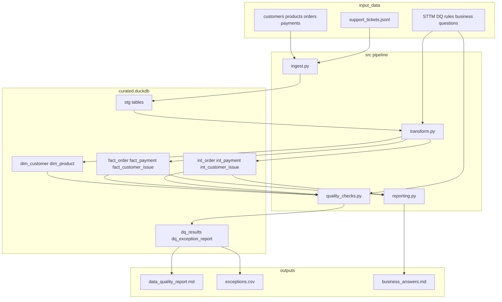

# OmniRetail Agentic Data Management

Local, reproducible OmniRetail pipeline: ingest raw files, build curated tables, run data-quality checks, and answer the five business questions.

Built for the **Agentic Data Management** take-home (`Take-home-exercise_v1`) using **Cursor** as the agentic coding assistant. Local-only — no cloud APIs.

## Pipeline flowchart



**One command:** `python -m src.pipeline` runs ingest → transform → quality → reporting end-to-end.

## How this follows the take-home brief

| Brief requirement | Where it lives |
|---|---|
| Ingest all `input_data` files | `src/ingest.py` |
| Suggested curated model (`dim_*` / `fact_*` + exception schema) | `src/transform.py`, `sql/curated_model.sql` |
| DQ: duplicates, bad FKs, timestamps, negative qty, inactive products, payment mismatches | `src/quality_checks.py` (DQ001–DQ013) |
| Exception report with severity + recommended handling | `outputs/exceptions.csv` |
| Answer all 5 business questions (not hard-coded) | `sql/business_questions.sql` → `outputs/business_answers.md` |
| Recommended repo layout | This folder structure |
| README + runnable single command | This file + `src/pipeline.py` |
| `AI_USAGE.md` / `APPROACH.md` | Repo root |
| Tests / validation | `tests/test_quality_checks.py` |
| Local-only stack | Python + DuckDB + pandas |

Suggested model columns are implemented (phone, signup_date, duplicate flag, calculated amount / variance, payment_date, ticket description, suggested_action on exceptions). See `APPROACH.md` for design decisions.

## Repository structure

Matches `Take-home-exercise_v1` recommended layout:

```
omni-retail-agentic-data-management/
  input_data/
  src/
    pipeline.py
    ingest.py
    transform.py
    quality_checks.py
    reporting.py
  sql/
    curated_model.sql
    business_questions.sql
  tests/
    test_quality_checks.py
  outputs/
    curated.duckdb
    data_quality_report.md
    exceptions.csv
    business_answers.md
  README.md
  AI_USAGE.md
  APPROACH.md
  requirements.txt
```

## Setup

Python 3.10+ required. Local-only (no cloud APIs).

```bash
cd omni-retail-agentic-data-management
python -m pip install -r requirements.txt
```

## Run

```bash
python -m src.pipeline
```

Or:

```bash
python src/pipeline.py
```

Then open:

- `outputs/data_quality_report.md`
- `outputs/exceptions.csv`
- `outputs/business_answers.md`

## Tests

```bash
python -m pytest tests/ -q
```

## Design summary

- **Ingest:** CSV/JSONL → DuckDB staging tables.
- **Transform:** STTM-aligned dims/facts with brief-suggested columns. Invalid FKs quarantine to exceptions; `int_*` tables keep cleaned rows for DQ and Q3.
- **Quality:** Rules from `input_data/data_quality_rules.csv` plus inactive-product check (`DQ013`) and missing-payment flag.
- **Analytics:** SQL in `sql/business_questions.sql` against the model (not hard-coded). Completed revenue excludes non-positive quantities.

## Build iterations (agentic process)

What changed while steering Cursor on this exercise:

1. **First pass from `input_data` only** — Built a working DuckDB pipeline when only the data pack was in the Cursor workspace (the `.docx` brief was outside the folder).
2. **Found `Take-home-exercise_v1.docx`** — Re-read the official brief and **rejected** the invented ad-hoc layout (`omni_retail_dm/`) for submission.
3. **Restructured to the recommended tree** — Created `omni-retail-agentic-data-management/` with the exact `src/` / `sql/` / `tests/` / `outputs/` layout from section 8 of the brief.
4. **Enriched the curated model** — Expanded from STTM-minimal columns to the **suggested target model** (phone, variance, duplicate flag, suggested_action, etc.).
5. **Split outputs** — Replaced one combined Markdown report with `data_quality_report.md`, `exceptions.csv`, and `business_answers.md`.
6. **Added mandatory docs** — `AI_USAGE.md` and `APPROACH.md`.
7. **Verification loop** — Ran pipeline + pytest; independently confirmed Q1–Q5 (including O1021 payment mismatch, O1024 missing payment, Q5 overlap 0.5).

Details of tool prompts, accepts/rejects, and verification are in `AI_USAGE.md`. Assumptions and tradeoffs are in `APPROACH.md`.
