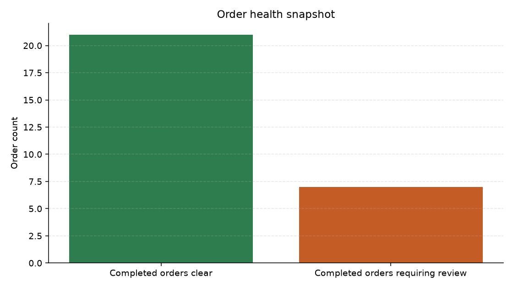
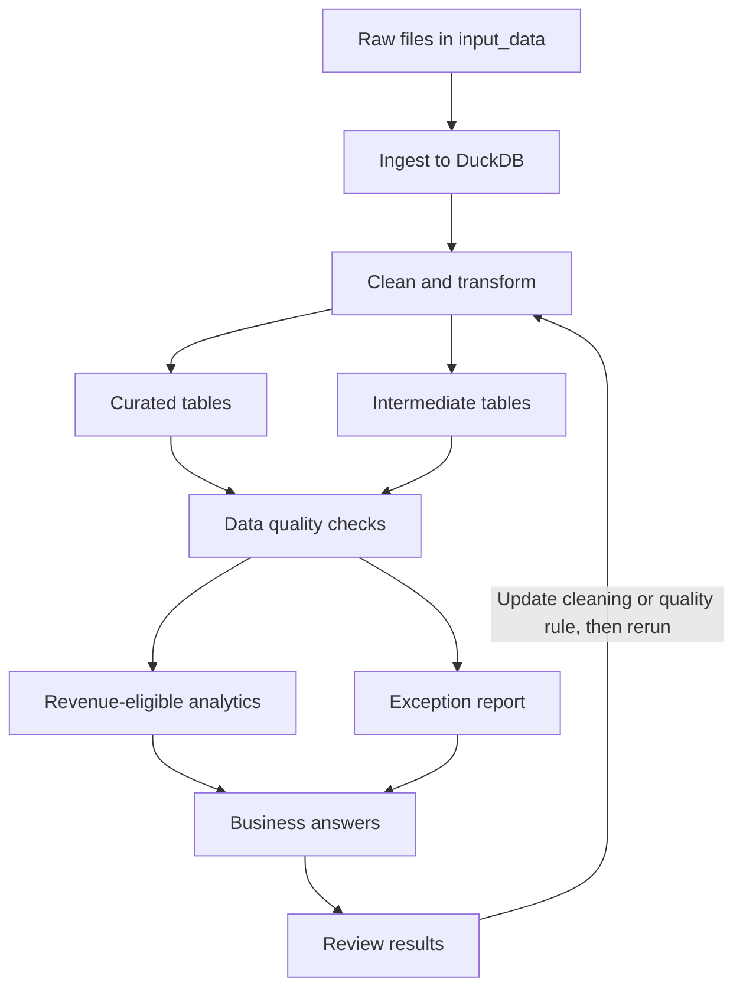

# OmniRetail Data Management Pipeline

This project builds a local data pipeline for OmniRetail customer-360 and order reconciliation work. It reads the provided source files, creates curated tables, runs data quality checks, writes an exception report, and answers five business questions with SQL.

The pipeline is modular so each layer has a clear job: load data, clean and model it, validate it, then report on it.

## Snapshot

The pipeline generates mutually exclusive counts for completed orders that are clear and completed orders requiring review. See `outputs/order_health_snapshot.md` for the current table. The chart refreshes on every pipeline run without modifying this README.



## Repository structure

```
omni-retail-agentic-data-management/
├── input_data/          Source CSVs, JSONL, STTM mapping, and DQ rules
├── src/
│   ├── pipeline.py      Single entrypoint
│   ├── ingest.py        Load raw files into DuckDB
│   ├── transform.py     Clean data and build curated tables
│   ├── quality_checks.py
│   └── reporting.py     Write Markdown and CSV outputs
├── sql/
│   ├── curated_model.sql
│   └── business_questions.sql
├── tests/               Row count, reference, amount, and parsing checks
├── outputs/             Generated database and reports
├── README.md
├── APPROACH.md          Design decisions and tradeoffs
├── AI_USAGE.md          How the agentic tool was used and verified
└── requirements.txt
```

## Technology stack

- Python 3.10+
- DuckDB
- pandas
- matplotlib (generated report charts)
- SQL
- pytest

## Pipeline workflow



How to read this:

1. **Ingest** loads all CSV and JSONL files into DuckDB.
2. **Clean and transform** builds curated tables with valid foreign keys, and also keeps a second set of cleaned tables for audit. Those audit tables still include orders or payments with bad customer, product, or order IDs.
3. **Data quality checks** review both curated and audit tables, then write analytics for revenue-eligible data and an exception list for problems.
4. **Business answers** mainly use the curated tables. Question 3 uses the centralized `vw_order_exceptions` audit view.
5. **Review** means a person checks the reports. If a total or rule looks wrong, they update the cleaning logic or a quality rule and run the pipeline again.

## What each layer does

### Ingestion

`src/ingest.py` loads:

- `customers.csv`
- `products.csv`
- `orders.csv`
- `payments.csv`
- `support_tickets.jsonl`

Supporting guidance files (`sttm_target_mapping.csv`, `data_quality_rules.csv`, question list) are reference specifications used to implement the Python and SQL logic. The pipeline is not metadata-driven and does not execute those CSV files as configuration. Ingestion validates the five required source files and their required columns before loading them into DuckDB.

### Curated model

| Table | Purpose |
|------|---------|
| `dim_customer` | Deduplicated customers with standardized name, email, phone, country, state, signup date, and loyalty tier |
| `dim_product` | Products with category, unit price, and active flag |
| `fact_order` | Orders with valid customer/product keys, amounts, variance, shipping state, and a revenue-eligibility flag |
| `fact_payment` | Payments linked to curated orders |
| `fact_customer_issue` | Support tickets with category and sentiment |
| `dq_exception_report` | Rule failures with severity and suggested action |

The pipeline also keeps audit tables (`int_order`, `int_payment`, `int_customer_issue`). These hold cleaned rows even when a customer, product, or order ID does not match. That way quality checks and business question 3 can still list the problem records.

### Customer cleaning

- Build `full_name` from first and last name
- Lowercase email
- Map country values such as US / United States to `USA`
- Map full state names to two-letter codes
- Parse mixed signup-date formats
- Remove repeated customer IDs (example: two rows for `C006`) and keep one cleaned customer record
- Write the removed duplicate to the exception report
- Flag shared phone numbers for review, but do not automatically merge different customer IDs

### Product cleaning

- Cast unit price to numeric
- Keep inactive products in the dimension for history
- Flag completed orders that use inactive products

### Order transformation

- Remove duplicate order `O1018`
- Parse mixed timestamp formats into an order date
- Standardize shipping state
- Cast quantity and totals to numeric
- Calculate `calculated_order_amount = quantity x unit_price`
- Calculate `order_amount_variance = gross_order_amount - calculated_order_amount`
- Keep orders with invalid customer or product IDs out of `fact_order`, but still store them in the audit tables and exception report

### Payment reconciliation

- Parse payment dates and cast amounts
- Compare settled payments to completed order totals
- Detect missing payments, amount mismatches, and orphan payments
- Preserve payments linked to quarantined orders in `int_payment` and flag them before excluding them from `fact_payment`
- Keep voided and refunded payments available for audit context

Known examples:

- `O1021`: order total $50.00, settled payment $44.00
- `O1024`: completed order with no settled payment
- `PMT029`: orphan payment for nonexistent order `O9999`
- `PMT019` and `PMT020`: payments linked to orders excluded from `fact_order`

### Support ticket processing

- Load JSONL tickets
- Parse timestamps when possible
- Preserve tickets with bad timestamps, set curated date null, and log an exception
- Flag tickets with invalid customer references
- Use negative sentiment for the relationship analysis in question 5

## Data quality checks

Checks cover duplicates, invalid references, timestamp failures, negative quantities, inactive products, order arithmetic mismatches, payment mismatches, missing payments, and payments tied to quarantined orders. DQ001 to DQ012 come from the provided reference file; DQ013 to DQ016 are documented extensions for the brief and reconciliation workflow.

Each exception row includes:

- Rule ID
- Dataset
- Record key
- Severity
- Issue description
- Suggested action

Outputs:

- `outputs/exceptions.csv` for row-level investigation
- `outputs/data_quality_report.md` for rule summary plus a severity chart
- `outputs/charts/` for generated PNG images used in the reports

## Business answers

Answers are produced by `sql/business_questions.sql` against the curated model. They are not hard-coded. Each pipeline run also writes charts under `outputs/charts/` and embeds them in `business_answers.md` with the **table first, then the chart**.

**Completed revenue definition:** `is_revenue_eligible = true`, meaning completed status, valid customer and product keys, a parsed order date, and quantity greater than zero. Revenue eligibility is separate from data quality status. For example, an eligible order can still have a payment mismatch or use an inactive product, and that exception remains visible for review.

| Question | Method in short | Visual |
|----------|-----------------|--------|
| 1. What is completed revenue by month? | Sum revenue-eligible order totals by year-month | Bar chart |
| 2. Who are the top 10 customers by completed order value? | Join revenue-eligible orders to `dim_customer`, aggregate, sort | Horizontal bar chart |
| 3. Which orders have payment/FK/quantity exceptions? | List exception orders | Table |
| 4. Which shipping states have the highest completed revenue? | Group revenue-eligible completed revenue by order shipping state | Bar chart |
| 5. Relationship between negative tickets and exceptions? | Customer overlap rate and detail | Tables |

Current Q1 result under that definition:

| Month | Completed revenue | Orders |
|-------|------------------:|-------:|
| 2025-03 | $440.70 | 9 |
| 2025-04 | $356.97 | 7 |
| 2025-05 | $446.20 | 9 |

See `outputs/business_answers.md` for the full generated answers, tables, and charts.

## Installation

```bash
cd omni-retail-agentic-data-management
python -m pip install -r requirements.txt
```

## Running the pipeline

```bash
python -m src.pipeline
```

Or:

```bash
python src/pipeline.py
```

This regenerates:

- `outputs/curated.duckdb`
- `outputs/data_quality_report.md`
- `outputs/exceptions.csv`
- `outputs/business_answers.md`
- `outputs/order_health_snapshot.md`
- `outputs/charts/*.png`

## Updating with new data

This pipeline does a full refresh on each run. It does not watch folders, stream events, or load only new rows.

To include new data:

1. Add or replace files in `input_data/` (same file names and column layout).
2. Run `python -m src.pipeline` again.
3. Review the regenerated reports under `outputs/`.

Example: if new rows are appended to `orders.csv` and `payments.csv`, they are included only after that rerun. Until then, the existing output files stay unchanged.

Each run rebuilds the DuckDB database and report files from whatever is currently in `input_data/`.

## Running the tests

```bash
python -m pytest tests/ -q
```

Tests check source-to-curated reconciliation, input schemas, curated columns, all five business answers, all DQ rule IDs, intentional defect keys, quarantined-payment visibility, generated report files, and bad timestamp preservation.

## Design summary

- When the same customer or order ID appears more than once, the transform keeps one row and logs the rest.
- Shared phone numbers are only flagged for review. Different customer IDs are not merged automatically.
- Orders with invalid customer or product IDs are left out of curated fact tables, but kept in audit tables and the exception report.
- Settled payments are compared to completed order totals. Voided or refunded payments are not treated as current settled cash.
- Business SQL lives in `sql/` so analytics stay easy to review outside Python.

## Build process notes

Cursor (Auto agent router) was used to plan, generate, and debug the pipeline. Claude Code and Codex were used for review and cross-checks. Generated code was run and verified before acceptance. Details are in `AI_USAGE.md`.

## Assumptions and limitations

- When duplicate IDs appear and the source has no update timestamp, the pipeline keeps the earliest usable row. Exact ties use original source-row order as a deterministic final tie-breaker.
- Country and state standardization focuses on US values in this sample.
- Overlap between negative tickets and exceptions is visible in this sample, but the dataset is too small for causal claims.
- There is no file watcher, streaming ingest, or auto-detect for new drops. New data is processed only when someone updates `input_data/` and reruns the pipeline.
- There is no incremental (delta-only) load and no SCD Type 2 history. Each run reprocesses the full current extract.

More tradeoff detail is in `APPROACH.md`.
