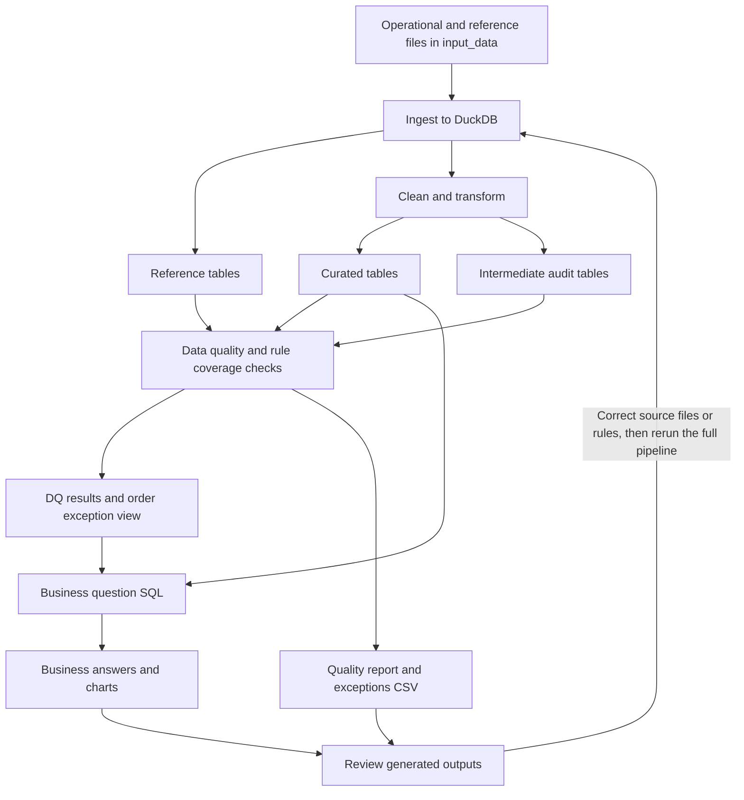

# OmniRetail Data Management Pipeline

This project builds a local data pipeline for OmniRetail customer-360 and order reconciliation work. It reads the provided source files, creates curated tables, runs data quality checks, writes an exception report, and answers five business questions with SQL.

The pipeline is modular so each layer has a clear job: load data, clean and model it, validate it, then report on it.

## Project outcome

The pipeline processes the supplied OmniRetail datasets and produces:

- Curated customer, product, order, payment, and support-ticket tables
- Data-quality and source-to-curated reconciliation reports
- SQL-generated answers to the five business questions
- Ten automated validation tests covering transformations, quality rules, analytics, and generated outputs

## Snapshot

`Completed` describes the order status recorded in the source data; it does not mean the order passed every quality check. The snapshot places each completed order in one of two groups: no identified order or payment issues, or at least one identified issue. In the current data, 21 completed orders have no identified issues and 7 have issues. The seven affected orders include the five listed in Q3, O1015 for an inactive product, and O1018 because the source contained a duplicate row. See `outputs/order_health_snapshot.md` for the table. The chart is regenerated when the pipeline runs.


## Repository structure

```
omni-retail-agentic-data-management/
├── input_data/          Source CSVs, JSONL, STTM mapping, and DQ rules
├── src/
│   ├── pipeline.py      Single entrypoint
│   ├── ingest.py        Load raw files into DuckDB
│   ├── transform.py     Clean data and build curated tables
│   ├── quality_checks.py
│   └── reporting.py     Write Markdown and CSV outputs
├── sql/
│   ├── curated_model.sql
│   └── business_questions.sql
├── tests/               Row count, reference, amount, and parsing checks
├── outputs/             Generated database and reports
├── README.md
├── APPROACH.md          Design decisions and tradeoffs
├── AI_USAGE.md          How the agentic tool was used and verified
├── requirements.txt     Supported minimum dependency versions
└── requirements-lock.txt Exact versions used for final verification
```

## Technology stack

- Python 3.10+
- DuckDB
- pandas
- matplotlib (generated report charts)
- SQL
- pytest

## Pipeline workflow



How to read this:

1. **Ingest** loads the five operational CSV/JSONL datasets and two reference CSVs into DuckDB.
2. **Clean and transform** creates curated tables with valid foreign keys and intermediate audit tables that preserve records with invalid references.
3. **Data quality checks** examine both sets of tables. They produce DQ results, validate coverage of the supplied rules, and create the order-exception view.
4. **Business question SQL** uses curated tables for revenue analysis and the order-exception view for Q3 and Q5.
5. **Reporting** generates the quality report, exceptions CSV, business answers, and charts.
6. **Review and rerun** means correcting source data or pipeline rules when necessary, then running the entire pipeline again from ingestion.

## What each layer does

### Ingestion

`src/ingest.py` loads:

- `customers.csv`
- `products.csv`
- `orders.csv`
- `payments.csv`
- `support_tickets.jsonl`
- `sttm_target_mapping.csv` as `ref_sttm_target_mapping`
- `data_quality_rules.csv` as `ref_data_quality_rules`

The two reference CSVs are loaded for traceability. After the DQ checks run, the pipeline verifies that every rule ID supplied in `ref_data_quality_rules` has a result in `dq_results`. The transformations and checks remain explicit Python/SQL rather than a metadata-driven rules engine. The Markdown context and question files remain documentation inputs.

### Curated model

| Table | Purpose |
|------|---------|
| `dim_customer` | Deduplicated customers with standardized name, email, phone, country, state, signup date, and loyalty tier |
| `dim_product` | Products with category, unit price, and active flag |
| `fact_order` | Orders with valid customer/product keys, amounts, variance, shipping state, and a revenue-eligibility flag |
| `fact_payment` | Payments linked to curated orders |
| `fact_customer_issue` | Support tickets with category and sentiment |
| `dq_exception_report` | Rule failures with severity and suggested action |

Financial columns in the physical DuckDB model use `DECIMAL(18,2)`, including product price, order amounts, variance, and payment amount.

The pipeline also keeps audit tables (`int_order`, `int_payment`, `int_customer_issue`). These hold cleaned rows even when a customer, product, or order ID does not match. That way quality checks and business question 3 can still list the problem records.

### Customer cleaning

- Build `full_name` from first and last name
- Lowercase email
- Flag missing or syntactically invalid email, including missing email on `C004`
- Map country values such as US / United States to `USA`
- Map full state names to two-letter codes
- Parse mixed signup-date formats
- Remove repeated customer IDs (example: two rows for `C006`) and keep one cleaned customer record
- Write the removed duplicate to the exception report
- Flag shared phone numbers for review, but do not automatically merge different customer IDs. `C019` remains separate from `C001` pending identity confirmation; `C016` also shares the same phone number, so phone alone is not a safe merge key.

### Product cleaning

- Cast unit price to numeric
- Keep inactive products in the dimension for history
- Flag completed orders that use inactive products

### Order transformation

- Remove one duplicate `O1018` row while retaining one canonical O1018 order
- Parse mixed timestamp formats into an order date
- Standardize shipping state
- Cast quantity and totals to numeric
- Calculate `calculated_order_amount = quantity x unit_price`
- Calculate `order_amount_variance = gross_order_amount - calculated_order_amount`
- Keep orders with invalid customer or product IDs out of `fact_order`, but still store them in the audit tables and exception report
- Keep O1030 in `fact_order` for audit, but exclude it from revenue because its completed quantity is negative

### Payment reconciliation

- Parse payment dates and cast amounts
- Resolve repeated `payment_id` values deterministically before loading `fact_payment`
- Compare settled payments to completed order totals
- Detect missing payments, amount mismatches, and orphan payments
- Preserve payments linked to quarantined orders in `int_payment` and flag them before excluding them from `fact_payment`
- Keep voided and refunded payments available for audit context

Known examples:

- `O1021`: order total $50.00, settled payment $44.00
- `O1024`: completed order with no settled payment
- `PMT029`: orphan payment for nonexistent order `O9999`
- `PMT019` and `PMT020`: payments linked to orders excluded from `fact_order`

### Support ticket processing

- Load JSONL tickets
- Parse timestamps when possible
- Preserve tickets with bad timestamps, set curated date null, and log an exception
- Flag tickets with invalid customer references
- Use negative sentiment for the relationship analysis in question 5

## Data quality checks

Checks cover duplicates, missing or invalid email, invalid references, timestamp failures, negative quantities, inactive products, order arithmetic mismatches, payment mismatches, missing payments, and payments tied to quarantined orders. DQ001 to DQ012 come from the provided reference file; DQ013 to DQ016 are documented extensions for the brief and reconciliation workflow. For DQ002, the STTM instruction to flag missing email clarifies the shorter rule wording "when available."

DQ001 and DQ004 validate uniqueness after duplicate resolution. Source duplicates remain visible as transformation exceptions.

Each exception row includes:

- Rule ID
- Dataset
- Record key
- Severity
- Issue description
- Suggested action

Outputs:

- `outputs/exceptions.csv` for row-level investigation
- `outputs/data_quality_report.md` for rule summary plus a severity chart
- `outputs/reconciliation_report.md` for source-to-curated row and revenue bridges
- `outputs/charts/` for generated PNG images used in the reports

## Business answers

Answers are produced by `sql/business_questions.sql` against the curated model. They are not hard-coded. Each pipeline run also writes charts under `outputs/charts/` and embeds them in `business_answers.md` with the **table first, then the chart**.

The five business questions are answered using the curated model. O1019 and O1020 remain in the audit and exception outputs but are excluded from completed-revenue calculations because their customer or product references are invalid.

**Completed revenue definition:** `is_revenue_eligible = true`, meaning completed status, valid customer and product keys, a parsed order date, and quantity greater than zero. Revenue eligibility is separate from data quality status. For example, an eligible order can still have a payment mismatch or use an inactive product, and that exception remains visible for review.

| Question | Method in short | Visual |
|----------|-----------------|--------|
| 1. What is completed revenue by month? | Sum revenue-eligible order totals by year-month | Bar chart |
| 2. Who are the top 10 customers by completed order value? | Join revenue-eligible orders to `dim_customer`, aggregate, sort | Horizontal bar chart |
| 3. Which orders have payment/FK/quantity exceptions? | List exception orders | Table |
| 4. Which states have the highest completed revenue? | Group revenue-eligible completed revenue by order shipping state | Bar chart |
| 5. Relationship between negative tickets and exceptions? | Compare exception rates for customers with and without negative tickets, then show customer detail | Tables |

Current Q1 result under that definition:

| Month | Completed revenue | Orders |
|-------|------------------:|-------:|
| 2025-03 | $440.70 | 9 |
| 2025-04 | $356.97 | 7 |
| 2025-05 | $446.20 | 9 |

Reconciliation notes:

- April revenue is `$356.97`. Adding quarantined orders `O1019` (`$24.99`) and `O1020` (`$12.99`) would produce `$394.95`, but the STTM sends their invalid foreign keys to the exception path rather than `fact_order`.
- Q4 groups revenue by the order's shipping state, not the customer's home state. O1019 and O1020 both ship to Illinois, so including them would produce `$315.95` for IL. The curated result excludes their `$37.98`, leaving IL at `$277.97`; MA is therefore highest at `$278.23`, a difference of `$0.26`.
- Q5 uses the same five exception categories as Q3. Customers with negative tickets have a 50.0% exception rate (3 of 6), compared with 7.7% (1 of 13) among customers without negative tickets. This is a visible association in the supplied data, but the sample is small and does not show that the exceptions caused the tickets.

See `outputs/business_answers.md` for the full generated answers, tables, and charts.

## Installation

```bash
cd omni-retail-agentic-data-management
python -m pip install -r requirements.txt
```

For the exact dependency versions used in the final verified run:

```bash
python -m pip install -r requirements-lock.txt
```

## Running the pipeline

```bash
python -m src.pipeline
```

Or:

```bash
python src/pipeline.py
```

This regenerates:

- `outputs/curated.duckdb`
- `outputs/data_quality_report.md`
- `outputs/exceptions.csv`
- `outputs/business_answers.md`
- `outputs/reconciliation_report.md`
- `outputs/order_health_snapshot.md`
- `outputs/charts/*.png`

## Updating with new data

This pipeline performs a full refresh each time it runs. New data is processed only after the files in `input_data/` are updated and the pipeline command is run again. It does not support automatic ingestion, streaming, or incremental loading.

To include new data:

1. Add or replace files in `input_data/` (same file names and column layout).
2. Run `python -m src.pipeline` again.
3. Review the regenerated reports under `outputs/`.

Example: if new rows are appended to `orders.csv` and `payments.csv`, they are included only after that rerun. Until then, the existing output files stay unchanged.

Each run rebuilds the DuckDB database and report files from whatever is currently in `input_data/`.

## Running the tests

```bash
python -m pytest tests/ -q
```

This prints a summary such as `10 passed in 3.50s`. Runtime varies by computer. To display every test name while it runs:

```bash
python -m pytest tests/ -v
```

The ten tests cover:

1. Country and state standardization
2. Customer duplicate resolution
3. Order duplicate resolution, references, and amount variance
4. Required input schema validation
5. Source-to-curated row reconciliation, referential integrity, and reference-table loading
6. DQ001 to DQ016, supplied-rule coverage, and the known intentional defects
7. Quarantined-payment visibility and bad timestamp preservation
8. Missing and syntactically invalid email handling
9. Regression results for business questions Q1 to Q5, including both Q5 comparison groups and customer detail
10. Curated schema columns, exact decimal money types, and generated report/chart files

The pipeline and tests are separate commands. `python -m src.pipeline` generates data products; `python -m pytest tests/ -v` verifies them and displays the test names.

## Design summary

- When the same customer or order ID appears more than once, the transform keeps one row and logs the rest.
- Shared phone numbers are only flagged for review. Different customer IDs are not merged automatically.
- Orders with invalid customer or product IDs are left out of curated fact tables, but kept in audit tables and the exception report.
- Settled payments are compared to completed order totals. Voided or refunded payments are not treated as current settled cash.
- Business SQL lives in `sql/` so analytics stay easy to review outside Python.

## Build process notes

Cursor (Auto agent router) was used to plan, generate, and debug the pipeline. Claude Code and ChatGPT (GPT-5.6 Sol) were used for review and cross-checks. Generated code was run and verified before acceptance. Details are in `AI_USAGE.md`.

## Assumptions and limitations

- When duplicate IDs appear and the source has no update timestamp, the pipeline keeps the earliest usable row. Exact ties use original source-row order as a deterministic final tie-breaker.
- Country and state standardization focuses on US values in this sample.
- Customers with negative tickets have a higher observed exception rate than customers without them, but the dataset is too small for causal claims.
- New data is processed only after the source files are updated and the pipeline is run again; ingestion does not start automatically.
- There is no incremental (delta-only) load and no SCD Type 2 history. Each run reprocesses all current source files.

## Conclusion

This project provides OmniRetail with a repeatable local pipeline for customer, product, order, payment, and support-ticket data. It creates the curated tables required for customer-360 analysis and checks whether orders and payments agree.

For the provided OmniRetail data files, 25 completed orders contribute `$1,243.87` to reported revenue. The reports identify the highest-revenue month, customers, and shipping states, as well as five orders with the reference, payment, or quantity problems requested in Q3. The data-quality report contains 18 exception rows with the affected record, severity, and recommended action.

The business answers use the curated tables, while `outputs/exceptions.csv` keeps the records that require correction. When OmniRetail updates the source files, rerunning the pipeline rebuilds the database and reports using the same documented rules.

More tradeoff detail is in `APPROACH.md`.
