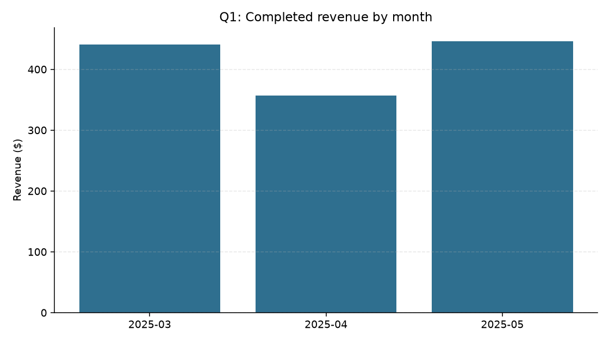
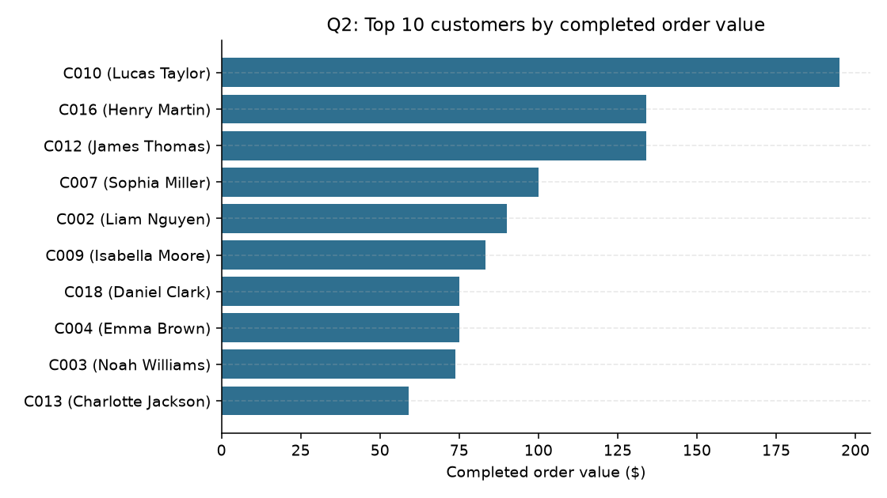
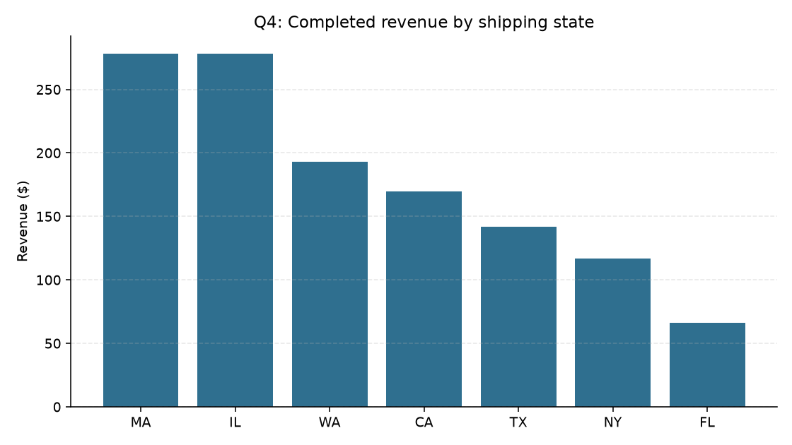

# Business Question Answers

Answers are generated with SQL from `sql/business_questions.sql` against the curated model. Values are not hard-coded. Each section shows the table first, then the chart. Charts refresh when the pipeline runs.

## Q1. What is completed revenue by month?

Revenue-eligible completed orders: valid customer and product IDs, a parsed order date, and quantity greater than zero. Payment and catalog exceptions remain visible in the quality report.

| month | completed_revenue | completed_order_count |
| --- | --- | --- |
| 2025-03 | 440.70 | 9 |
| 2025-04 | 356.97 | 7 |
| 2025-05 | 446.20 | 9 |

## Q2. Who are the top 10 customers by completed order value?

| customer_key | full_name | loyalty_tier | completed_order_value | completed_orders |
| --- | --- | --- | --- | --- |
| C010 | Lucas Taylor | Gold | 194.98 | 2 |
| C012 | James Thomas | Bronze | 133.98 | 2 |
| C016 | Henry Martin | Silver | 133.98 | 2 |
| C007 | Sophia Miller | Gold | 99.98 | 2 |
| C002 | Liam Nguyen | Silver | 89.99 | 2 |
| C009 | Isabella Moore | Bronze | 83.25 | 2 |
| C018 | Daniel Clark | Gold | 75.00 | 1 |
| C004 | Emma Brown | Gold | 74.97 | 1 |
| C003 | Noah Williams | Bronze | 73.75 | 2 |
| C013 | Charlotte Jackson | Silver | 59.00 | 1 |

## Q3. Which orders have payment mismatches, missing payments, invalid customer references, invalid product references, or suspicious quantities?

This answer is intentionally limited to the five exception categories named in the question. The data quality report also covers issues such as inactive products and order arithmetic variance.

| order_key | customer_key | product_key | order_status | quantity | gross_order_amount | issues |
| --- | --- | --- | --- | --- | --- | --- |
| O1019 | C999 | P002 | completed | 1 | 24.99 | invalid_customer_reference |
| O1020 | C001 | P999 | completed | 1 | 12.99 | invalid_product_reference |
| O1021 | C002 | P008 | completed | 4 | 50.00 | payment_amount_mismatch |
| O1024 | C009 | P006 | completed | 1 | 42.00 | missing_payment |
| O1030 | C018 | P010 | completed | -1 | -21.00 | suspicious_quantity |

## Q4. Which states have the highest completed revenue?

For this answer, state means the order shipping state, not the customer's home state.

| state | completed_revenue | completed_order_count |
| --- | --- | --- |
| MA | 278.23 | 4 |
| IL | 277.97 | 6 |
| WA | 192.98 | 3 |
| CA | 169.72 | 4 |
| TX | 141.98 | 3 |
| NY | 117.00 | 2 |
| FL | 65.99 | 3 |

## Q5. Is there any visible relationship between negative support tickets and order or payment exceptions?

The exception-customer group uses the same five categories as Q3 so the comparison is consistent and reproducible.

### Summary

| negative_ticket_customers | also_have_exceptions | overlap_rate |
| --- | --- | --- |
| 6 | 3 | 0.500 |

### Customer detail

| customer_key | full_name | negative_ticket_count | categories | has_order_payment_exception |
| --- | --- | --- | --- | --- |
| C001 | Ava Patel | 1 | delivery | True |
| C002 | Liam Nguyen | 1 | billing | True |
| C018 | Daniel Clark | 1 | billing | True |
| C006 | Mason Davis | 1 | billing | False |
| C014 | Benjamin White | 1 | return | False |
| C017 | Harper Lee | 1 | delivery | False |

