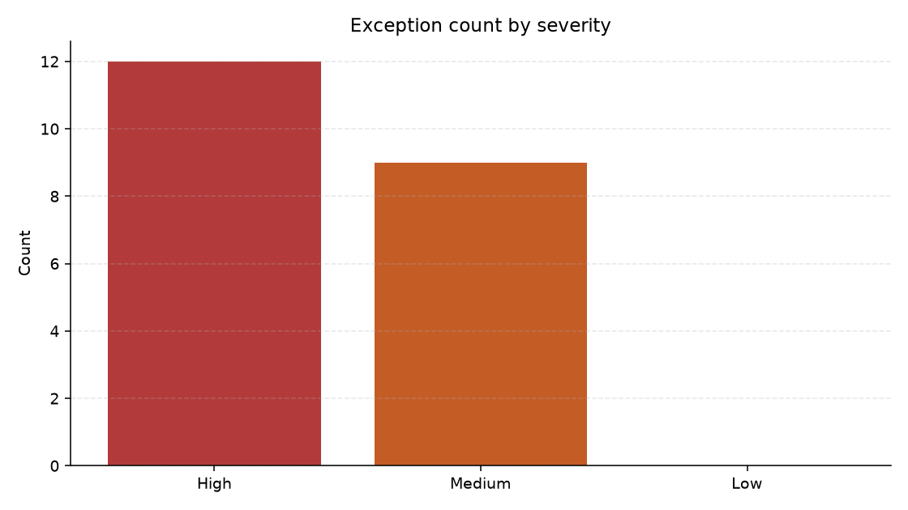

# Data Quality Report

Generated from the curated DuckDB model and DQ001 to DQ013 checks.

## Pipeline row counts

| table_name | row_count |
| --- | --- |
| stg_customers | 20 |
| stg_products | 12 |
| stg_orders | 31 |
| stg_payments | 30 |
| stg_support_tickets | 10 |
| dim_customer | 19 |
| dim_product | 12 |
| fact_order | 28 |
| fact_payment | 27 |
| fact_customer_issue | 9 |

- Rules passed: **3**
- Rules failed: **10**
- Exception rows: **21**

## Exception count by severity

| severity | exception_count |
| --- | --- |
| High | 12 |
| Medium | 9 |
| Low | 0 |

## Rule results

| rule_id | description | severity | status | fail_count |
| --- | --- | --- | --- | --- |
| DQ001 | customer_id must be unique after duplicate resolution | High | PASS | 0 |
| DQ002 | email should be present and syntactically valid when available | Medium | FAIL | 1 |
| DQ003 | country and state must be standardized | Medium | PASS | 0 |
| DQ004 | order_id must be unique | High | PASS | 0 |
| DQ005 | customer_id must exist in customers | High | FAIL | 1 |
| DQ006 | product_id must exist in products | High | FAIL | 1 |
| DQ007 | completed orders must have positive quantity | High | FAIL | 1 |
| DQ008 | order_total should equal quantity times product unit_price | High | FAIL | 1 |
| DQ009 | payment order_id must exist in orders | High | FAIL | 1 |
| DQ010 | settled payment amount should equal completed order total | High | FAIL | 1 |
| DQ011 | created_ts must parse to a valid timestamp | Medium | FAIL | 1 |
| DQ012 | customer_id should exist in customers | Medium | FAIL | 1 |
| DQ013 | completed orders should not reference inactive products | Medium | FAIL | 1 |

## Exception preview

Full detail: `exceptions.csv` (`dq_exception_report`).

| rule_id | dataset | record_key | severity | issue_description | suggested_action |
| --- | --- | --- | --- | --- | --- |
| BQ003_MISSING_PAYMENT | orders | O1024 | High | completed order missing settled/refunded payment | Create or locate missing payment record before closing order |
| DQ005 | orders | O1019 | High | invalid customer_key=C999 | Quarantine order; repair customer_key via MDM lookup |
| DQ006 | orders | O1020 | High | invalid product_key=P999 | Quarantine order; repair product_key in catalog |
| DQ007 | orders | O1030 | High | completed order quantity=-1 | Hold completed order with non-positive quantity for ops review |
| DQ008 | orders | O1021 | High | order_total=50.0 calculated=44.0 variance=6.0 | Reconcile order_total vs qty*unit_price; correct pricing feed |
| DQ009 | payments | PMT029 | High | orphan order_key=O9999 | Reject orphan payment or create missing order if legitimate |
| DQ010 | payments | PMT021 | High | settled amount=44.0 order_total=50.0 order=O1021 | Investigate settled amount vs completed order total mismatch |
| TRANSFORM_DEDUP_CUSTOMER | customers | C006 | High | Duplicate customer_id dropped; kept earliest/most-complete row | Merge profiles in source MDM and retain single survivor key |
| TRANSFORM_DEDUP_ORDER | orders | O1018 | High | Duplicate order_id dropped | Investigate source double-write; keep single canonical order row |
| TRANSFORM_ORDER_FK | orders | O1019 | High | invalid customer_id=C999 | Quarantine order until dimension keys are repaired |
| TRANSFORM_ORDER_FK | orders | O1020 | High | invalid product_id=P999 | Quarantine order until dimension keys are repaired |
| TRANSFORM_PAYMENT_ORPHAN | payments | PMT029 | High | orphan payment order_id=O9999 | Reject or hold payment until matching order is loaded |
| DQ002 | customers | C004 | Medium | missing email | Request missing/invalid email from CRM before marketing use |
| DQ011 | support_tickets | T010 | Medium | unparseable created_ts=bad_timestamp | Fix malformed ticket timestamp in source system |
| DQ012 | support_tickets | T005 | Medium | invalid customer_key=C999 | Link ticket to valid customer_key or quarantine |
| DQ013 | orders | O1015 | Medium | completed order uses inactive product P011 | Flag completed sales of inactive products for catalog review |
| INFO_FUZZY_CUSTOMER_PHONE | customers | C001 | Medium | shared phone 312-555-0101 with other customer_id(s); not merged | Review for customer-360 merge; keep separate keys until confirmed |
| INFO_FUZZY_CUSTOMER_PHONE | customers | C016 | Medium | shared phone 312-555-0101 with other customer_id(s); not merged | Review for customer-360 merge; keep separate keys until confirmed |
| INFO_FUZZY_CUSTOMER_PHONE | customers | C019 | Medium | shared phone 312-555-0101 with other customer_id(s); not merged | Review for customer-360 merge; keep separate keys until confirmed |
| TRANSFORM_TICKET_FK | support_tickets | T005 | Medium | invalid customer_id=C999 | Map ticket to surviving customer_key or quarantine |
| TRANSFORM_TICKET_TS | support_tickets | T010 | Medium | unparseable created_ts=bad_timestamp | Fix source timestamp encoding and re-ingest ticket |

